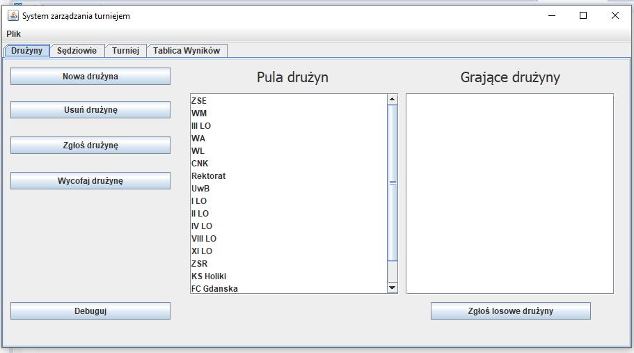
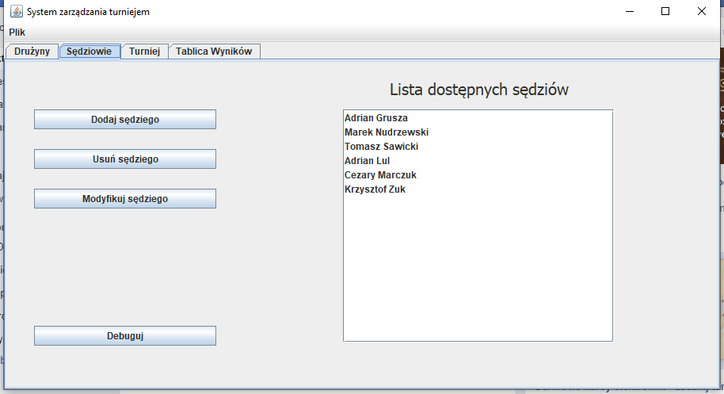
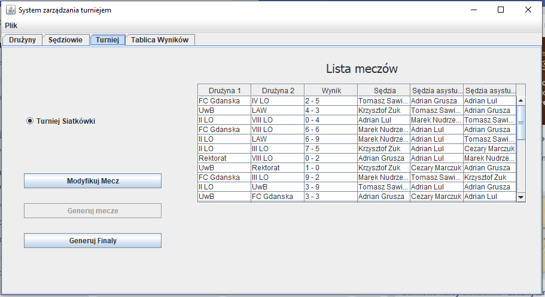
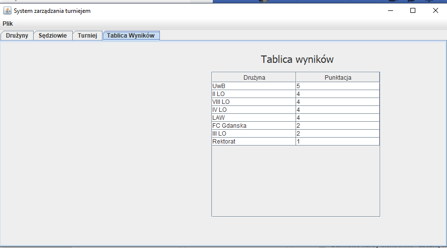

# Projekt: Aplikacja zarządzająca rozgrywkami sportowymi

**Poziom**: średniozaawansowany

## Opis
Na plaży Bitnacji oprócz plażowania toczą się też rozgrywki w 3 grach zespołowych: siatkówka plażowa, 
2 ognie i przeciąganie liny. Każda z drużyn składa się ze stałej liczby zawodników. Toczą oni 
mecze/spotkania na zasadzie każdy z każdym. Pierwsze 4 drużyny z największą liczbą zwycięstw przechodzą 
do półfinałów a ich zwycięzcy do finałów. Każde ze spotkań sędziuje sędzia,
 a dodatkowo w siatkówce 2 sędziów pomocniczych.

Przykładowe widoki aplikacji

#### Oczekiwania

Minimalny zakres funkcjonalności

* zarządzanie sędziami (CRUD)
* zarządzanie drużynami (CRUD)
* organizacja rozgrywek w każdej dyscyplinie: tworzenie meczów (spotkań), wpisywanie wyników, automatyczne generowanie 
półfinałów i finałów
* wyświetlanie tabeli wyników
* eksport wyników do pdf | Excel | html | xml | json
* zarządzanie aplikacją z poziomu CLI

Dodatkowe elementy projektu

* graficzny interface użytkownika, technologia do wyboru
    * Java Swing
    * JavaFX
____
#### Cel projektu

Zorganizowanie pracy w małych grupach nad potencjalnie rzeczywistą aplikacją. Zbudowanie sprawnych
zespołów podobnych do rzeczywistych isniejących w firmach. Rozwinięcie umiejętności komunikacyjnych. 
Sposób na rozprzestrzenianie się wiedzy między uczestnikami i tym samym powtórzenie materiału oraz wyrównanie
poziomu wiedzy. Budowanie zaufania między członkami zespołu.

#### Technologia
* Java 8 lub nowsza
* Java Swing, JavaFX
* maven
* Hibernate
* baza danych do zapisu informacji: MySQL, PostgreSQL, etc.
* biblioteki zewnętrzne, np Apache Commons 

#### Instrukcje
Uczestnicy dobierają się w co najmniej 2-osobowe zespoły. Wewnętrznie uzgadniają między sobą zadania. 
Trener pełni rolę PM/PO. Wykonane zadania są umieszczone na repozytorium na Github lub podobnym, do którego 
trener ma dostęp. Postęp prac jest sprawdzany na bieżąco.  